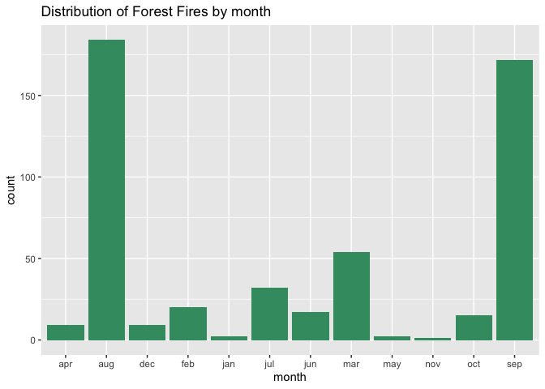

<!-- README.md is generated from README.Rmd. Please edit that file -->

# ForestFires

<!-- badges: start -->


<!-- badges: end -->

The goal of ForestFires is to present data for a particularly
challenging regression task of predicting the size of the burned area
using various meteorological measurements.

## Installation

You can install the released version of ForestFires from
[CRAN](https://CRAN.R-project.org) with:

``` r
install.packages("ForestFires")
```

## Example

This is a basic example which shows you how to solve a common problem:

``` r
library(ForestFires)
## distribution of observations by month
library(tidyverse)
ForestFires%>%
  group_by(month)%>%
  summarize(count = n())%>%
  ggplot(aes(x = month, y = count)) + 
  geom_col(fill ="#3D9970") +
  ggtitle("Distribution of Forest Fires by month")
```



``` r

## basic ggpairs for regression preliminary analysis
library(GGally)
ggpairs(data = ForestFires, columns = 7:13, title = "Basic scatter plot matrix")
```


